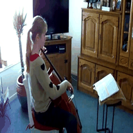

# Video Swin Transformer


[](https://twitter.com/search?q=%23FreePalestine&src=typed_query)

[](https://arxiv.org/abs/2106.13230) []([?](https://img.shields.io/badge/keras-2.12-darkred)) [](https://colab.research.google.com/drive/1Q7A700MEI10UomikqjQJANWyFZktJCT-?usp=sharing) [](https://huggingface.co/spaces/innat/VideoSwin) [](https://huggingface.co/innat/videoswin)


VideoSwin is a pure transformer based video modeling algorithm, attained top accuracy on the major video recognition benchmarks. In this model, the author advocates an inductive bias of locality in video transformers, which leads to a better speed-accuracy trade-off compared to previous approaches which compute self-attention globally even with spatial-temporal factorization. The locality of the proposed video architecture is realized by adapting the [**Swin Transformer**](https://arxiv.org/abs/2103.14030) designed for the image domain, while continuing to leverage the power of pre-trained image models.

This is a unofficial `Keras 3` implementation of [Video Swin transformers](https://arxiv.org/abs/2106.13230). The official `PyTorch` implementation is [here](https://github.com/SwinTransformer/Video-Swin-Transformer) based on [mmaction2](https://github.com/open-mmlab/mmaction2). The official PyTorch weight has been converted to `Keras 3` compatible. This implementaiton supports to run the model on multiple backend, i.e. TensorFlow, PyTorch, and Jax. However, to work with `tensorflow.keras`, check the `tfkeras` branch.


# Install 

```python
!git clone https://github.com/innat/VideoSwin.git
%cd VideoSwin
!pip install -e . 
```

# Checkpoints

The **VideoSwin** checkpoints are available in `.weights.h5` for Kinetrics 400/600 and Something Something V2 datasets. The variants of this models are `tiny`, `small`, and `base`. Check [model zoo](https://github.com/innat/VideoSwin/blob/main/MODEL_ZOO.md) page to know details of it. 


# Inference

A sample usage is shown below. We can pick any backend, i.e. tensorflow, torch or jax.

```python
>>> import  os
>>> import torch
>>> os.environ["KERAS_BACKEND"] = "torch"
>>> from videoswin import VideoSwinT

>>> model = VideoSwinT(
    num_classes=400,
    include_rescaling=False,
    activation=None
)
>>> _ = model(torch.ones((1, 32, 224, 224, 3)))
>>> model.load_weights('model.weights.h5')

>>> container = read_video('sample.mp4')
>>> frames = frame_sampling(container, num_frames=32)
>>> y_pred = model(frames)
>>> y_pred.shape
TensorShape([1, 400])

>>> probabilities = torch.nn.functional.softmax(y_pred).detach().numpy()
>>> probabilities = probabilities.squeeze(0)
>>> confidences = {
    label_map_inv[i]: float(probabilities[i]) \
    for i in np.argsort(probabilities)[::-1]
}
>>> confidences
```
A classification results on a sample from [Kinetics-400](https://paperswithcode.com/dataset/kinetics-400-1).

| Video | Top-5 |
|:---:|:---|
|  | <pre>{<br>    'playing_cello': 0.9941741824150085,<br>    'playing_violin': 0.0016851733671501279,<br>    'playing_recorder': 0.0011555481469258666,<br>    'playing_clarinet': 0.0009695519111119211,<br>    'playing_harp': 0.0007713600643910468<br>}</pre> |


To get the backbone of video swin, we can pass `include_top=False` params to exclude the classification layer. For example:

```python
from videoswin.backbone import VideoSwinBackbone

backbone = VideoSwinT(
    include_top=False, input_shape=(32, 224, 224, 3)
)
```

By default, the video swin officially is trained with input shape of `32, 224, 224, 3`. But, We can load the model with different shape. And also load the pretrained weight partially.

```python
model = VideoSwinT(
    input_shape=(8, 224, 256, 3),
    include_rescaling=False,
    num_classes=10,
)
model.load_weights('model.weights.h5', skip_mismatch=True)
```

**Guides**

- To ensure the keras reimplementation with official torch: [logit comparison](guides/video-swin-transformer-keras-and-torchvision.ipynb)
- To train with tensorflow backend:
- To trian with torch backend:
- To train with jax backend:
- To train with torch-lightening (torch backend):


##  Citation

If you use this videoswin implementation in your research, please cite it using the metadata from our `CITATION.cff` file.

```swift
@article{liu2021video,
  title={Video Swin Transformer},
  author={Liu, Ze and Ning, Jia and Cao, Yue and Wei, Yixuan and Zhang, Zheng and Lin, Stephen and Hu, Han},
  journal={arXiv preprint arXiv:2106.13230},
  year={2021}
}
```
